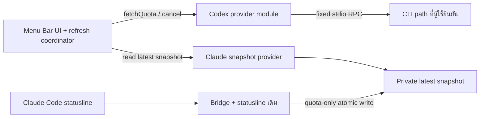

# แผนเชื่อมข้อมูลแบบเปิดแอปเดียว — ฉบับ source-build public repo

> สถานะหลังลงมือ: ดู [STATUS](../STATUS.md) และ [DECISIONS ข้อ 20](../DECISIONS.md) เอกสารนี้เก็บ design/baseline ก่อน implementation ไม่ใช่สถานะปัจจุบัน

ปรับ 2026-10-03 หลัง [Claude review และภาคผนวก source audit](2026-10-03-one-app-integration-plan-review.md) · **สองเงื่อนไขผ่านใน default CLI 0.160.0 context; พร้อม S1 ในขอบเขตนี้**
แทนฉบับ XPC เดิมและข้อเสนอ manual collector; DECISIONS ข้อ 14 เป็นข้อสรุปปัจจุบัน

## 1. เป้าหมายที่ตกลงแล้ว

- GitHub public source repo ให้ผู้ใช้ build เองด้วย Xcode; ไม่เข้า App Store ไม่ notarize ไม่สมัคร Apple Developer Program
- แอปเดียว **ไม่เปิด App Sandbox แต่เปิด Hardened Runtime** ใช้ local ad-hoc signing; ไม่มี XPC/peer-signing service หรือเฟส XPC spike
- Swift + frameworks ของ Apple ไม่มี dependency library ภายนอก; macOS minimum 14, UI text-only ภาษาไทยตามที่รับแล้ว
- Codex: official CLI app-server ผ่าน stdio ดึง quota จริงเมื่อเริ่มแอป/ทุก 5 นาที/กดรีเฟรช จำกัด request ไม่ถี่กว่า 1 นาที
- Claude: snapshot ล่าสุดจาก Claude Code ไม่แยก sessions; ป้าย “จาก Claude Code ล่าสุด เวลา X” โดย X เป็นเวลารับ snapshot ไม่ใช่เวลายืนยัน quota จาก server
- Claude installer ต้องมี preview/backup/rollback สำหรับผู้ใช้คนอื่น ทำหลังเชื่อม Codex ได้แล้ว
- รอบนี้ทำ startup probe และแก้เอกสารเท่านั้น ยังไม่เปลี่ยน app targets/entitlements/Swift ไม่สร้างหรือ push public repo

กลุ่มผู้ใช้เริ่มต้นคือคนที่ติดตั้งและ login Codex CLI/Claude Code แล้ว การมี subscription บนเว็บอย่างเดียวไม่รับประกันว่าเชื่อมวิธีนี้ได้

## 2. การทดสอบผลข้างเคียงที่ทำก่อนแก้แผน

ผลเต็ม: [Codex startup probe](../validation/2026-10-03-codex-startup-side-effects.md)

บน CLI **0.160.0** เส้นทาง initialize → initialized → account/rateLimits/read ได้ result จริง และไม่พบการเรียก MCP/hooks/notify canary ใน quota-only path รอบ guarded ที่ปิด integrations ใน child ก็ยังอ่าน quota ได้และ config.toml เดิมไม่เปลี่ยน
Positive control ขอ mcpServerStatus/list แล้ว MCP canary ถูกเรียกจริง จึงยืนยัน MCP detector

ข้อจำกัดสำคัญ: ใช้ config เดิมเป็นฐาน แต่ MCP จริง 3 รายการถูกปิดและใช้ canary แทน, hooks/notify เป็นคำสั่ง probe, plugins/remote-control/Code Mode host/telemetry ปิดทุกกรณี ไม่ได้รัน integrations เดิมทั้งหมดแบบ unguarded ไม่ทดสอบ model turn เพื่อกระตุ้น hooks/notify และไม่รับรองทุก CLI version/config

ใช้ guard จาก source/docs จริงโดย **ไม่แก้ config ของผู้ใช้**:

```text
features.hooks=false
notify=[]
mcp_servers={ "ชื่อที่ค้นพบแต่ละตัว"={enabled=false}, ... }
features.plugins=false
features.remote_control=false
features.code_mode_host=false
analytics.enabled=false
otel.exporter="none"
otel.trace_exporter="none"
```

ทั้งหมดเป็น CLI -c overrides เฉพาะ child; ไม่ใช่แก้ ~/.codex/config.toml
`mcp_servers={}` ไม่ล้างรายการเดิมเพราะ recursive merge และ dotted key parser ไม่รองรับ quoted segments ตามที่อาจคาดจาก TOML จึงใช้ explicit inline map ที่ครอบคลุมชื่อจริง

Source ของ official tag rust-v0.160.0: [overrides](https://github.com/openai/codex/blob/rust-v0.160.0/codex-rs/config/src/overrides.rs), [merge](https://github.com/openai/codex/blob/rust-v0.160.0/codex-rs/config/src/merge.rs), [MCP fields](https://github.com/openai/codex/blob/rust-v0.160.0/codex-rs/config/src/mcp_types.rs), [features](https://github.com/openai/codex/blob/rust-v0.160.0/codex-rs/features/src/lib.rs), [notify event](https://github.com/openai/codex/blob/rust-v0.160.0/codex-rs/hooks/src/legacy_notify.rs)

## 3. ข้อแก้จากรีวิวและโครงสร้าง

| Finding | ข้อแก้ในแผน | สถานะหลักฐาน |
|---|---|---|
| B1 MCP discovery | ใช้ guarded app-server config/read inventory รอบแรก แล้ว child รอบสองพร้อม disable map ไม่ใช้ mcp list เป็นทางหลัก | ผ่าน source+runtime fixture ใน default context; named v2 profile/enterprise policy ไม่ได้ runtime-verify |
| B2 silent unknown guard | initialize → config/read/assert guards → quota; ไม่ตรงปิด child | config/read ร่วม experimentalFeature/list จาก registry/runtime state; ไม่ใช้เพียง echoed key=false |
| B3 unknown notification | discard valid no-id notifications ยกเว้น disguised token refresh; response/server request strict | รอแก้ source/tests ใน S1; รอบนี้เปลี่ยนเอกสารเท่านั้น |
| B4 npm/nvm | resolve package native binary แล้วให้ user confirm; ไม่ launch Node หรือ custom shim | Claude ตรวจ package layout และ shebang แล้ว; แจ้งเลือกใหม่เมื่อ native path หาย |




| ส่วน | API/หน้าที่ | ข้อจำกัด |
|---|---|---|
| CodexAppServerProvider | fetchQuota, cancel | encapsulate Process/stdio/launch policy; ไม่มี runCommand/readFile/fetchURL/sendRPC ทั่วไป |
| CodexExecutableSettings | ค้นหา candidate ครั้งแรก, confirm/choose path, remember choice | ตรวจพบไฟล์/สิทธิ์ execute/path เปิดได้เท่านั้น ไม่ทำระบบ provenance/vendor signature/Team ID |
| CodexLaunchPolicy | app-server inventory รอบแรก/guarded quota รอบสอง | config/read และ registry/runtime assertions, decode bounded memory เฉพาะชื่อ/enabled/guards ไม่เก็บ transport/env/header; ไม่เขียน TOML parser |
| RefreshCoordinator | timer, manual refresh, cancellation, store updates | MainActor UI ไม่ block; single-flight, request generation, throttle/cooldown |
| ClaudeSnapshotProvider | อ่าน latest validated quota snapshot | ไม่รู้รายละเอียด credential/account/session ไม่มี session selector/hash/pseudonym |
| ClaudeBridgeInstaller | preview/apply/restore เฉพาะ bridge/settings ที่เป็นเจ้าของ | backup/compare-before-write/rollback; ไม่มี general file writer API |

การแยก module เป็นขอบเขตโค้ด **ไม่ใช่ OS permission boundary** แอปไม่มี App Sandbox จึงมีสิทธิ์ผู้ใช้ปกติ; Hardened Runtime ไม่เท่ากับจำกัดการอ่านไฟล์/network แบบ Sandbox ต้องบอกเรื่องนี้ใน README

## 4. Codex implementation ที่ต้องทำหลังรีวิว

### Path และ launch policy

1. ค้นหา native Codex จาก PATH/ตำแหน่งติดตั้งที่รองรับและไล่ nvm `~/.nvm/versions/node/*/lib/node_modules/@openai/codex` รวม Homebrew/npm global prefixes โดยไม่เปิด login shell
2. ถ้า candidate เป็น codex.js ใน npm package ให้ resolve native `vendor/<platform-triple>/bin/codex` ผ่าน layout ของ package/optional platform package แล้วแสดง native path ให้ผู้ใช้ confirm หรือเลือกเอง **ไม่รันผ่าน Node และไม่ใช้ custom shell shim เป็น fallback** ไม่ทำระบบ provenance
3. เก็บ path ใน settings ใช้ fixed argument array; เมื่อ nvm update แล้ว path หาย/permission ไม่ผ่าน ให้แจ้งและเลือกใหม่ ไม่สลับ executable เงียบ ๆ ใช้ CODEX_MANAGED_BY_NPM/CODEX_MANAGED_PACKAGE_ROOT ตาม launcher ที่อ่านจริงเท่าที่จำเป็น ไม่ถือว่า metadata นี้รับรอง vendor identity
4. ทุก refresh ที่พ้น cooldown ใช้ app-server **สอง child ตามลำดับ** กับ native executable/cwd/auth context เดียวกัน ไม่ใช้ mcp list --json เป็น discovery ทางหลักและไม่ cache รายชื่อใน MVP
5. child รอบแรกใช้ static guards รวม plugins=false/hooks=false/notify=[]/code_mode_host=false/telemetry off; remote_control feature เดิมเป็น Removed/no-op ไม่ใช่ functional guard → initialize/initialized → experimentalFeature/list ตรวจ canonical guard names/runtime enabled=false → config/read (`includeLayers=false`) เอาชื่อ mcp_servers → close/reap ไม่ขอ quota
6. การตรวจ registry ในรอบแรกเพิ่มจากภาคผนวกเพื่อไม่ถือว่าค่า -c ถูกใช้ก่อนอ่าน inventory; ไม่ใช่ OS guarantee ว่า startup ก่อน handshake ไม่มี side effects จึงต้องผ่าน no-spawn canary ด้วย
7. สร้าง explicit inline disable map สำหรับทุกชื่อใน inventory โดย enabled=false พร้อม disabled transport placeholder ตาม kind ที่ validate (stdio command=/usr/bin/false หรือ HTTP URL=https://example.invalid/) เพื่อให้ bootstrap parse project-only MCP ได้ escape TOML basic strings ถูกต้อง ไม่คัดลอก args/env/header/credential ลง arguments แล้ว close/reap child แรกก่อนเปิดรอบสอง; unknown/conflicting kind ให้ unsupported
8. child รอบสองใช้ static guards + disable map → initialize/initialized → experimentalFeature/list ยืนยัน known features/runtime false (รวม pagination และ stage/no-op) → config/read ยืนยัน notify=[] และ MCP ทุกตัว disabled รวม guard fields อื่นที่ใช้ → จึง account/rateLimits/read
9. ถ้า inventory/registry/config assertion missing/type ผิด/true/not recognized/อ่านไม่ครบ/child cleanup ไม่จบ ให้ fail closed ไม่ขอ quota; key=false ที่ config/read echo มาไม่พอ เพราะ arbitrary bool feature key อาจถูก ignore
10. config/read ceiling แยกจาก quota response (เสนอเริ่ม 2 MiB แล้วปรับจากผลวัด); decode memory เอาเฉพาะชื่อ/enabled/guards ไม่ log/cache/raw fixture transport/env/header ใช้ auth/home เดิมไม่ย้าย HOME/CODEX_HOME/copy token

**ผลสองเงื่อนไขที่ตรวจแล้ว:** [inventory prerequisites validation](../validation/2026-10-03-codex-inventory-prerequisites.md)

- ก: source รวม enabled applicable layers; runtime fixture พบ user 3 + project 1 + CLI 1 พร้อม system/project/user/sessionFlags tags รอบสอง disabled ทั้ง 5; ใช้ cwd/overrides เดิม plugins=false verified จาก registry raw config ไม่รวม plugin-origin โดยตัวมันเอง
- ข: registry/config flow ทั้งสอง child ไม่เรียก MCP fixtures; positive control เปิด fixtures 2 ครั้ง ทำให้ detector เชื่อถือได้ guards hooks/plugins/code_mode_host registered+false และ notify ว่าง; ไม่ใช้ model/thread เพื่อกระตุ้น hook event

source/runtime evidence จำกัด CLI0.160 default direct app-server: --profile-v2 ไม่ถูก forward ใน entrypoint นี้; enterprise/cloud/managed policy มี source support แต่ไม่ได้ runtime-test ให้ unsupported เมื่อ guard invariants ไม่ตรง ไม่อ้าง named profile support หรือทุก config/OS version

การทดสอบครั้งนี้ไม่มี quota/model/thread, ไม่แก้ config ส่วนกลาง; app source/entitlements ยังไม่เปลี่ยน ก่อน S1 ต้องใช้ validation scope นี้ตามจริง

ถ้า ก หรือ ข ไม่ผ่าน ให้หยุดและเสนอ fallback mcp list พร้อมเปิดเผย HTTP auth-status/keyring/network effects ให้ owner พิจารณา **fallback ยังไม่อนุมัติ** รุ่น 0.160.0 ไม่มี skip-auth/offline switch ห้ามกลับไปใช้เงียบ ๆ หรือเขียน TOML/layering parser เป็น workaround โดยอัตโนมัติ

หลักฐาน: [ภาคผนวก Claude review](2026-10-03-one-app-integration-plan-review.md), [discovery/recognition source audit](../research/2026-10-03-mcp-discovery-source-audit.md) experimentalFeature/list iterate registry จริง; config/read เป็น merged config แต่ feature map อาจ echo unknown keys จึงตรวจสอง API ร่วมกัน

### Protocol, lifecycle และข้อมูล

- RPC allowlist เพิ่ม config/read และ experimentalFeature/list สำหรับ guard assertions: initialize → initialized → registry/config assertions → account/rateLimits/read; ไม่มี thread/turn/model/login/logout/credit reset และไม่ตอบ server token requests
- JSON notification ที่ valid, method เป็น string และ **ไม่มี id key** ให้ discard แม้ไม่รู้จัก method; ไม่ log payload ไม่ตอบกลับ ไม่ต้องไล่ allowlist ทุกชื่อ ยังคง byte/line limits และ reject malformed envelope/notification ที่ปลอมเป็น token refresh
- ถ้ามี id แม้เป็น null ให้เข้มแบบ response/server request ตามเดิม correlated reply ต้องถูกต้อง server requests ไม่ตอบและปิด child; เพิ่ม regression unknown notification แล้ว config/quota ยังสำเร็จ
- stdout/stderr bounded และ drain ทั้งสอง pipe; raw stderr/RPC/account payload ไม่ลง log/cache/fixtures
- ส่งกลับ model ที่ validate quota/window/reset แล้วเท่านั้น; weekly ต้อง 10080 นาที ไม่เดาว่า secondary คือสัปดาห์
- timeout ทั้ง fetch เสนอ 20 วินาที; close stdin → terminate → bounded cleanup/reap เฉพาะ process ของเรา; ไม่ killall หรือหยุด Codex session เดิมของผู้ใช้
- tests ต้องครอบคลุม EOF/timeout/broken pipe/oversized stream/cancel/quit/crash และ descendant ค้าง โดยไม่ต้องเปิด thread/model
- single-flight; ทุก 5 นาทีขณะแอปเปิด; request ไม่ถี่กว่า 1 นาทีรวม manual/wake/retry/relaunch; เก็บ non-secret last-request time ใน UserDefaults เพื่อ throttle ข้าม relaunch cooldown แสดงใน UI late result ไม่ทับ request ใหม่
- CLI-managed token refresh อนุมัติแล้ว; แอปไม่อ่าน/เก็บ/refresh token เอง API error ไม่กลายเป็นตัวเลข 0
- อ่าน quota ของ CLI login context ที่เลือก ไม่อ้าง email/account identity ที่เราไม่เคยตรวจ
- fresh observation ต้องมีหลักฐาน actual fetch; cache/read time ไม่แทน provider observation ถ้าผิดพลาด/หมดเวลา/reset ผ่านไปให้แสดงสถานะตามจริง

CLI อาจเขียน auth/state/logs และอาจเข้าถึง network ตาม config ของตัวเอง source/config audit เป็นหลักฐานพฤติกรรมที่ตรวจ ไม่ใช่ firewall allowlist ที่บังคับทุก packet ก่อนปล่อย source ต้อง README ระบุ delegation นี้และข้อจำกัด version/config ให้ชัด

## 5. Claude bridge หลัง Codex ใช้ได้

- ติดตั้ง native Swift/Foundation CLI helper และ wrapper ของเราใน **~/Library/Application Support/AIUsageBar/** ไม่เรียก runtime helper ที่ย้ายตาม .app ไม่ต้องเพิ่ม jq/python/node เป็น dependency ของ bridge
- Installer user-level เท่านั้น: preview ระบุ target/คำสั่งเดิม/ไฟล์ที่จะติดตั้ง ทำ backup แล้ว compare-before-write กับ bytes เดิม แก้เฉพาะ statusLine.command คง padding/field อื่นและ keys อื่นทั้งหมด
- project/local/managed statusline override อาจทำให้ session นั้นไม่ส่ง snapshot ให้เรา บอกใน UI/README ไม่เข้าไปแก้ project settings
- Wrapper native รับ stdin ใน memory แล้วส่ง **bytes เดิม** ให้ statusline เดิมก่อน คง stdout/stderr/exit/cancellation ตาม semantics ที่ตรวจ แล้ว ingest quota; helper ingest หาย/ล้มเหลวต้องไม่เปลี่ยน output/exit code เดิม ไม่ใช้ shell variables/temp file เก็บ raw JSON
- วัด added latency (เป้าหมายทดลอง <50 ms ไม่ใช่ผลผ่านแล้ว) และไม่ทำ output เดิมช้าจนรบกวน statusline; user original command อาจมี dependencies ของตัวเอง ซึ่ง bridge ไม่เพิ่มให้
- Atomic latest snapshot ตามข้อสรุป ไม่แยก sessions; label “จาก Claude Code ล่าสุด เวลา X” ซึ่ง X คือเวลารับ ข้อมูลอาจมาจาก session อื่นและไม่พิสูจน์บัญชีปัจจุบัน
- **C3 owner เลือก ก แล้ว (DECISIONS ข้อ 17):** ถ้า valid input ล่าสุดไม่มี rate_limits/seven_day ให้เขียน explicit no-data snapshot ทับค่าเดิม แล้ว UI แสดง — ไม่เก็บตัวเลขของบัญชีก่อนเหมือนเป็นค่าปัจจุบัน ข้อ ข ไม่ใช้ใน implementation
- missing quota ต้องแยกจาก malformed JSON/invalid quota: no-data tombstone เป็น schema ที่ตั้งใจ ไม่ใช่เปลี่ยน field หายเป็น 0; invalid input ต้อง fail ไม่ทำ stale quota ดูสด
- ไม่เก็บ raw stdin/transcript/workspace/session ID/email/token; snapshot/private backups อยู่ใน Application Support, atomic replace และ bounded size/schema/owner/file-type checks
- อ่าน snapshot ซ้ำไม่ขยับเวลา successful fetch ของ provider; X แยก ingest time จาก providerObservedAt ที่ยังไม่มีหลักฐาน duplicate timer ไม่ถือเป็น upstream fetch ใหม่
- app move/Trash ไม่ทำ path ของ wrapper/helper หาย เพราะอยู่นอก bundle; helper file หายต้อง fallback output เดิมตามที่ตรวจ อย่ารับรองว่า wrapper ทั้งไฟล์ถูกลบแล้วจะยังเรียกได้
- explicit disconnect คืน original statusLine.command เฉพาะ state ที่เราเป็นเจ้าของแล้วลบเฉพาะไฟล์ติดตั้ง/backup/snapshot ที่ปลอดภัย ถ้าพบ modification conflict ไม่ทับหรือ rm ทั้งโฟลเดอร์โดยไม่ตรวจ
- ติดตั้งจริงนอก workspace ขอ escalation เมื่อ exact preview/backup พร้อม รอบนี้ไม่ติดตั้ง

## 6. ขั้นที่เหลือ

| ขั้น | ผลส่งมอบ | เกณฑ์ก่อนเดินต่อ |
|---|---|---|
| S0 — ปิด findings จาก Claude | แผนแก้ B1–B4, C1/C2 และคำตอบ C3 | review ทิศทางผ่านแล้ว; ผ่าน prerequisite tests ใน default context แล้ว; S1 ต้องรักษา invariants และ limitations ตาม validation; ไม่ใช้ mcp list เป็นทางหลัก ยังไม่เปลี่ยน architecture |
| S1 — ต่อ Codex | narrow module, native confirmed path, app-server inventory+quota สองรอบ, runtime guard assertion, real quota + refresh | layer completeness/no-spawn proof และ synthetic transport/lifecycle/discovery/unknown-notification/guard tests ผ่าน แล้วเทียบ quota/reset จริง ไม่เก็บบัญชี; เปลี่ยน target เป็น non-Sandbox + Hardened Runtime ตามข้อสรุปที่อนุมัติแล้ว ไม่ทำ P1 XPC spike |
| S2 — Claude installer/bridge | preview/backup/apply/rollback และ latest snapshot | synthetic preserving-wrapper/concurrent/latest/cleanup tests แล้วติดตั้งและ smoke ด้วย Claude Code ตามสิทธิ์ที่อนุมัติ |
| S3 — รวม UI/README และเตรียม public source | real menu state, build instructions, file/program disclosure, license/credits, secret check | refresh/error/freshness/reset/wake/quit/keyboard ผ่าน; source build โดยไม่ใช้ paid signing; ยังไม่อ้าง macOS14/Intel runtime ที่ไม่เคยทดสอบ |

การเตรียม repo public เป็นเป้าหมายที่ตกลงแล้ว แต่รอบนี้ไม่มี create remote/push/release; ผู้ใช้ขอส่งแผนให้ Claude ดูก่อน implement

README acceptance:

- วิธี build จาก Xcode: เปิด project เลือก scheme/destination แล้ว Build โดย local ad-hoc ไม่ต้อง Apple Developer Program/Developer ID; CLI command เป็นทางเลือกเพิ่มเติม
- บอกว่าไม่ได้ notarize, ไม่เข้า App Store, ไม่แจก binary ที่รับรองผ่าน Gatekeeper และอธิบาย macOS อาจแจ้งเตือนตามวิธีได้ไฟล์มา ไม่แนะนำปิด Gatekeeper ทั้งเครื่อง
- อธิบาย App Sandbox ปิด/Hardened Runtime เปิด และแยกสิทธิ์ OS จากขอบเขตที่โค้ดตั้งใจใช้
- ตารางไฟล์/โปรแกรม: native CLI path ที่เลือก, CLI-resolved config/plugin MCP ที่ถูกปิด, CLI-owned auth/state/log access, user Claude settings และ Application Support/AIUsageBar wrapper/helper/backup/snapshot; แอปไม่อ่าน TOML config/layering เอง
- workflow หลักใหม่ใช้ app-server 2 process: inventory หนึ่งรอบ + guarded quota หนึ่งรอบ; cadence 5 นาที = 576 process ต่อ 24 ชั่วโมงที่แอปเปิดตลอด ยังไม่ได้วัด resource overhead และ error/manual refresh อาจต่าง ไม่กล่าวว่า cost เป็นศูนย์
- source/no-data/session limitation, user-only installer และ project override ที่ไม่ส่ง snapshot ต้องเปิดเผย
- แยกสิ่งที่แอป build 5 ทำได้จริงตอนนี้กับพฤติกรรมหลังเชื่อม ไม่อ้างว่า integration เสร็จจากแผน

## 7. หลักฐานปัจจุบันและ prompt สำหรับ Claude

หลักฐานเพิ่ม: [Claude review](2026-10-03-one-app-integration-plan-review.md) และ [discovery/recognition source audit](../research/2026-10-03-mcp-discovery-source-audit.md); audit อ่าน source เท่านั้น ไม่รัน CLI/บัญชีในรอบนี้

Offline core/RPC เดิม: 61 tests และ Release build 5 ผ่านในรอบก่อน; [validation](../validation/2026-10-03-codex-rpc.md)
รอบนี้: startup probe ได้ quota result จริงใน guarded/canary flow; ไม่มีการแก้ source/entitlements, build แอปใหม่ หรือ bridge install แอป build 5 ปัจจุบันยัง Sandbox/offline จน S1

> รีวิว docs/plans/2026-10-03-one-app-integration-plan.md ฉบับล่าสุดแบบ read-only อ่าน DECISIONS ข้อ 14, STATUS และ docs/validation/2026-10-03-codex-startup-side-effects.md ก่อน ยึด GitHub public source-build, single non-Sandbox app + Hardened Runtime, ไม่มี XPC/Apple Developer/notarization/provenance system และ Claude latest snapshot ไม่แยก sessions เป็นข้อสรุปผู้ใช้
>
> ตรวจว่าผล probe สนับสนุน guard แค่ไหน โดยไม่ตีความ controlled negative เป็น no-side-effects ทุก config ตรวจวิธีใช้ app-server inventory+quota สองรอบ, config/read layer completeness และ no-spawn canary ก่อนใช้ inventory, config/read effective guards และ unknown keys, override merge/key quoting, native path resolution โดยไม่ใช้ Node, protocol notifications, process cleanup และ stale/account wording ตรวจ installer preview/backup/rollback/missing-app fallback กับ README file/program disclosure และ ad-hoc source build
>
> ส่ง findings เรียง severity พร้อมข้อ/ไฟล์ หลักฐาน เหตุการณ์ และแนวแก้ที่เล็กที่สุด แยก blocker ก่อน S1/ก่อน account smoke/ก่อน public source ออกจาก optional improvement อย่ารัน reference scripts/build หรือเปิด credential/บัญชีจริง ไม่แก้ source/global settings ไม่ publish/push ทิศทางผ่าน Claude review แล้ว B1–B4 แก้ในเอกสารนี้ แต่ inventory proof ผ่านใน default context ตาม validation; C3 เลือก ก แล้วก่อนขั้นที่เกี่ยวข้อง ไม่ใช่คำสั่งเริ่ม implementation
