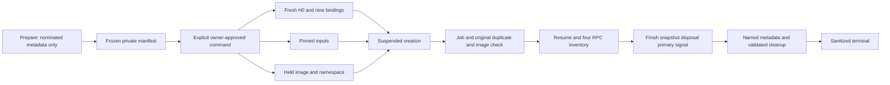

# DRAFT — REVIEW FIXES REQUIRED: Windows bounded native H2 preparation and separately approved single invocation

Owner resumed a short drafting/self-gate segment after the pause. Final callback
and fixture corrections were merged; actual CLI review subsequently returned
fix-then-proceed (5Major/1Minor/1Info). Corrections remain pending. This draft is not source-plan/dispatch or native-run approval. The
[pause record](../HANDOFF-2026-10-06-132751-windows-h2-native-plan-paused.md)
remains historical; the current checkpoint below records the resume.

2026-10-06 · DECISIONS35 authorizes architectural/source planning and actual CLI
plan review only. The actual architect returned this design as text; lead is
the sole saved-plan writer. Owner source-plan/dispatch and native-run approvals
are still pending. No source/build/test/H0/native action in this planning round.

## Summary

Prepare a test-runner-only harness for the exact four-method H2 inventory:
synthetic inputs, source-derived layer fingerprints, held executable/process
identities, bounded parsing and sanitized evidence. Implement and prove it with
fake/offline cases first, then produce a frozen reviewable native manifest
without invoking the provider. Fresh metadata-only H0 and at most one native
creation attempt require a later explicit owner run approval.

Inventory validity, owned cleanup and access coverage are separate. This does
not establish authenticated usage, no credential access, no network attempts,
zero egress, strict isolation or C1/C5 completion.

### Alternatives and selected design

| Option | Advantage | Cost/limit |
|---|---|---|
| Retain existing fake-only preparation | Smallest change; historical110-test baseline remains useful | No native inventory or executable/process binding evidence |
| Selected: explicit test-runner harness, frozen manifest, separate run gate | Current Win32/.NET transport; concrete reviewable command after fake proof; no Tray/provider activation | Finite new admission/fixture/identity code; shared-token/source/binary/observation limits remain |
| Hard-deadline keeper or disposable VM | Another design could strengthen lifetime/isolation | No VM available; adds architecture/tooling outside this bounded scope |

Choose cooperative30s RPC cancellation, independent2s cleanup waits and measured
soft cleanup acceptance. No watchdog, monitors, dependency, firewall or OS-policy
change. This owner-reviewed source amendment would deliberately introduce the
explicit test-runner routes below; earlier no-native-route preparation remains
historical. Merely building/testing the new routes never authorizes invoking one.

## Patterns to Mirror

| Category | Source | Pattern and adaptation |
|---|---|---|
| Source admission | docs/plans/2026-10-06-windows-h2-native-readiness.plan.md Tasks2–4 | Nine contexts/startup clone; nominated response cannot attest another loader |
| Fixture/fingerprints | docs/validation/2026-10-06-windows-h2-native-fixture-contract.md | 16 overrides, actual identities/goldens, dotenv and finite artifacts |
| Identity | docs/validation/2026-10-06-windows-h2-native-identity-contract.md | Whole-life chain/image, original-process duplicate pre-resume, single-query accounting |
| Owned launch | windows/src/AIUsageBar.Core/WindowsProcess.cs:44 | Explicit image/argv/cwd/env, inherited pipe allowlist, suspended→job→resume |
| Inspection | windows/src/AIUsageBar.Core/CodexDiscovery.cs:28 | PE/x64/fileID/size/hash under added external lifetime lease; public discovery unchanged |
| Private storage | windows/src/AIUsageBar.Core/PrivateFiles.cs:27,54,78 | Protected user/SYSTEM ACL/identities; exact CREATE_NEW files rather than changing PrivateFiles |
| Method set | windows/src/AIUsageBar.Core/CodexProvider.cs:64,133 | Immutable inventoryOnly:true; deny before stdin |
| Finish/disposal | CodexProvider.cs:159,179 | Natural finish/drain then awaited cleanup; canceled RPC token cannot skip it |
| Typed fake | windows/tests/AIUsageBar.Tests/H2InventoryTests.cs:172,234,351 | Bounds/typed guards/origins/request literals; fake Context/machine/v-* and PID reopen unsuitable for native |
| Safe output | windows/tests/AIUsageBar.Tests/Program.cs:43 | Fixed categories; no payload/diagnostics/exception message/path/env dump |
| Fresh H0 | C:/tmp/aiusagebar-h2-h0-reference.txt | Recovered exact historical source SHA3a9c9f…; compiled port requires differential review |

No native-specific fixture/serializer/admission implementation can be reused
unchanged. New test-only code supplies that boundary.

## Files to Change

### Source — exactly eight files

| File | Action | Producer → consumer → cleanup/test |
|---|---|---|
| windows/src/AIUsageBar.Core/NativeLaunchBinding.cs | CREATE | Manifest tuple→whole-life namespace/image lease and original-primary evidence→internal Start/coordinator→release after cleanup decision |
| windows/src/AIUsageBar.Core/WindowsProcess.cs | UPDATE | Internal overload→suspended create/duplicate/image check→single final snapshot/owned failure evidence; public Start unchanged |
| windows/tests/AIUsageBar.Tests/H2NativeFixture.cs | CREATE | Manifest/synthetic bytes→immutable context/nine bindings/layers/artifact graph→validation and identity-safe cleanup |
| windows/tests/AIUsageBar.Tests/H2NativeAdmission.cs | CREATE | Compiled H0 metadata port/fake API adapter→fresh admission→close token/buffer/folder resources |
| windows/tests/AIUsageBar.Tests/H2NativeInventory.cs | CREATE | Prepare/native entry→manifest/coordinator/parser/safe serializer→terminal evidence after cleanup |
| windows/tests/AIUsageBar.Tests/H2NativeIdentityTests.cs | CREATE | Fake image/process/adversarial namespaces→real Win32 binding/cleanup assertions |
| windows/tests/AIUsageBar.Tests/H2NativePreparationTests.cs | CREATE | Independent wire/manifest/guard/artifact fixtures/fake child→admission/parser/coordinator/output/cleanup matrix |
| windows/tests/AIUsageBar.Tests/Program.cs | UPDATE | h2-native/ offline registration and exact prepare/native/fake routes; native output bypasses offline account=false label |

No CodexDiscovery/PrivateFiles/CodexPolicy/CodexProvider/existing H2InventoryTests,
projects/dependencies/Tray/Bridge/Mac changes. InternalsVisibleTo and implicit
source compilation already exist; no project edits needed.

### Durable artifacts

| File | Action | Purpose |
|---|---|---|
| docs/plans/2026-10-06-windows-h2-native-implementation.plan.md | CREATE | Saved architectural implementation plan/dispositions |
| docs/plans/2026-10-06-windows-h2-native-implementation-review.md | CREATE | Actual CLI immutable input/verdict/coverage/provenance |
| docs/validation/2026-10-06-windows-h2-native-fixture-contract.md | CREATE | Source-derived fixture/version/artifact contract |
| docs/validation/2026-10-06-windows-h2-native-identity-contract.md | CREATE | Identity/ownership design |
| docs/validation/2026-10-06-windows-h2-native-preparation.md | CREATE after implementation | Actual build/fake/code-review/manifest evidence; native gate |
| docs/design/design.md, docs/design/diagrams/windows-h2-native.mmd | CREATE after source-plan approval | Architect-role required proposed boundary/flow; link this plan, no duplicate progress log |
| docs/adr/0001-h2-bounded-native-inventory.md | CREATE after source-plan approval | Proposed Context/Decision/Consequences/Alternatives for important boundary/budget decisions |
| windows/AGENTS.md, windows/README.md | UPDATE after source approval | Ownership/commands/budgets/limits |
| docs/DECISIONS.md, docs/STATUS.md, MEMORY.md, CHANGELOG.md | UPDATE | Actual authorization/outcome/checkpoint |

Rationale/flow stay here for review; architect-role durable design/ADR outputs
are Proposed until approved and reference this plan, not a parallel STATUS.
Ignored preparation artifacts: build/H2NativeApproval/<manifest-id>/.
Child scratch: build/H2NativeRuns/<manifest-id>/private/. Never commit either.

## Tasks

### Task 1: Freeze evidence and owner gates

- Action: Preserve existing work; bind the two source contracts, pin
  a956835d020762cb2b570053af06f643a11c0ecc, recovered H0 and this plan.
- Mirror: plan-gate and actual CLI review workflow.
- Validate: Actual CLI PLAN review/dispositions, then owner plan AND dispatch
  approval before eight source files change. Current baseline:
  C:/tmp/aiusagebar-h2-native-implementation-source-baseline.json.
- Boundary: Future source approval includes preparation/build/fake/code review/
  metadata-only manifest authoring, not fresh H0 or native invocation.

### Task 2: Concrete prepare/native/fake modes and manifest lifecycle

Exact new forms:

```text
--h2-prepare-native <manifest-id>
--h2-native-inventory <manifest-id> <manifest-sha256>
--fake-h2-native <controlled fake arguments>
```

- Action: Canonical GUID N ID and64 hexadecimal hash. Derive paths from verified
  test-assembly repository layout; no arbitrary image/manifest/cwd/output path.
- Prepare: Inspect ONLY the exact nominated installed image:
  C:/Users/Kraiwin_S/AppData/Roaming/npm/node_modules/@openai/codex/node_modules/@openai/codex-win32-x64/vendor/x86_64-pc-windows-msvc/bin/codex.exe.
  Package0.160.0-win32-x64, image SHA256
  fdda5fa3cf3fb3d000b876720742857676293e4315e4b045fae6f8bd7e866d1d.
  Capture current fileID/size under the reviewed lease and resolve only machine
  namespace metadata to freeze source/system identities. No full H0, settings/
  auth contents, PATH discovery, version/help or app-server.
- Manifest CREATE: Protected CREATE_NEW run-manifest.json, UTF8/no BOM;
  schema/kind/ID/one planned invocation; tuple/source pin/code hashes; derived
  roots; exact guards/env root IDs/nine context bindings/layer goldens/artifact
  classes/budgets/accepted observation+provenance limits. Bind all eight allowed
  source hashes plus executing test/Core assembly names+MVIDs, size, volume/file
  IDs and SHA256; apphost/tests DLL/deps/runtimeconfig/Core DLL exact relative
  identities and hashes. Hash frozen manifest bytes LAST; no source/DLL wildcard.
- READ/consume pair: Native opens ONLY the derived protected ordinary single-link
  manifest, verifies canonical GUID, protected identity, schema/kind/attempt=1
  and supplied digest. A recognized manifest authorizes a CREATE_NEW protected
  attempt receipt, flushed BEFORE checking current source/build/fixture/H0 state.
  Then compare all eight source hashes; running test/Core Assembly MVIDs and
  on-disk module IDs/sizes/hashes; and apphost/deps/runtimeconfig hashes. Any
  mismatch consumes the receipt and creates no child. Malformed/unrecognized
  manifest authorizes no receipt. Existing/partial receipts stay consumed;
  never overwrite/retry or learn expectations from responses.
- M4 consuming-code check: Before H0 or process creation compare the eight
  listed source files; executing Program/Test and Core Assembly names+MVIDs;
  their fixed paths, volume/file IDs, sizes and SHA256; and apphost/tests
  deps/runtimeconfig/Core DLL fixed artifact hashes. A mismatch consumes the
  receipt and creates no child. Missing/renamed/extra relevant consumer modules
  fail closed; no source-tree or DLL wildcard.
- Validate: Producer/consumer/replay, extra args/GUID/hash/schema/duplicate fields/
  path/ACL/link/reparse/mutation cases. Default/offline never selects native.
- Approval: Explicit command plus owner instruction is operational authority,
  not a new authentication subsystem or same-user isolation/replay guarantee.
- Exit semantics: Prepare has separate exit0 success/exit1 failure. Native exit0
  requires execution=completed, inventory=valid, natural finish,
  one copied job snapshot, primary signaled, supported after-state and cleanup
  clear; access coverage may still be unknown/inconclusive. Exit1 for execution
  not-started/failed/inconclusive, inventory not-run/invalid/inconclusive,
  missing/failed snapshot or signal, unsupported artifacts, or cleanup failed/
  inconclusive. Exit2 is syntax/GUID/hash-form failure before a recognized
  manifest. Preparation has its own result. Fake-child codes are separate.

### Prepare/run fixture lifecycle and frozen identities (M3)

Prepare requires an absent GUID-derived approval/run root. It CREATE_NEW-writes
the complete private fixtures, flushes/readbacks their authored bytes and records
volume/file IDs, type, link count, size, effective-ACL class and known hashes.
It records expected-absent native paths, root IDs and consumer/code identities,
then freezes the manifest last. Run reopens that exact tree and compares the
frozen IDs, types, links, ACLs and immutable bytes plus all expected-absent
paths. Run never recreates or overwrites a fixture; runtime outputs receive
separate IDs.

Prepare failure rolls back only objects created by that Prepare, child-first,
using its creation ledger and exact recorded IDs. If an object is replaced,
unknown, or cannot be safely deleted, retain the remainder; do not recurse or
reuse that GUID. Another Prepare requires a new GUID/root.

After the recognized manifest digest/schema are valid, Run creates and flushes a
protected CREATE_NEW one-shot receipt before code/source/fixture/H0 admission.
Consumer-code mismatch, stale IDs/content/ACL, missing/extra paths and H0 failure
consume that receipt and create no provider process. A stale or replaced object
is not silently repaired, and uncertain scratch is retained. The receipt cannot
be overwritten/replayed; partial-write failure is still consumed.

Tests pair the lifecycle: collision/pre-existing root, partial Prepare rollback,
every frozen ID/byte/ACL mutation, expected-absent path gained, stale consumer,
receipt failure/replay/partial write, mismatch after receipt with CreateProcess
count0, interrupted cleanup and retained unknown objects.

### Task 3: Synthetic fixture and all nine source contexts

Selected layout:

```text
private/
  home/config.toml              fixed nonempty comment bytes
  home/.env                     fixed nonempty comment bytes
  home/tmp/arg0/.h2-directory-pin fixed nonempty comment sentinel
  project/.codex/config.toml    fixed nonempty comment bytes
  project/.git/HEAD              fixed synthetic bytes
  temp/.h2-directory-pin         fixed nonempty comment sentinel
```

- Action: CREATE_NEW exact files with protected user/SYSTEM ACLs, flush/readback
  and fileIDs/hashes. Mirror PrivateFiles without its underscore restriction/
  writer-lock artifacts. Hold .env/config/HEAD DATA read pins denying data-write/
  delete throughout lifecycle; ordinary ancestry/single links required. Metadata
  mutability limits below remain explicit.
- Git: Fixed HEAD bytes `ref: refs/heads/h2-synthetic\n`; no gitdir/commondir,
  Git executable or external link. Missing/unreadable/substituted HEAD stops.
- Environment: Empty case-insensitive dictionary, exactly SystemRoot/WINDIR and
  CODEX_HOME/USERPROFILE/HOME/APPDATA/LOCALAPPDATA/TEMP/TMP. Home roots=home,
  TEMP/TMP=sibling temp, process cwd=project. No inherited PATH/auth/proxy/CA/
  OTEL/runtime hooks. Child self-PATH modification is disclosed separately.
- Comment inputs/sentinels: EXACT ASCII `# AIUsageBar H2 synthetic\n`,26bytes,
  SHA25648311959c00e8d77c92643da443861b0c7eda546208de270e420fe97d0fed68c.
  TOML parses to empty table; dotenvy comment parses to no imported key. Reject
  missing/malformed/any OTHER content. Layer goldens stay unchanged.
- Dotenv: Hold this nonempty comment file against DATA-write/delete. Sharing does
  not freeze attributes/EAs. Nonzero data plus denied truncation mitigates ONLY
  standard SYMLINK's zero-size requirement; not all tags/ABA/access isolation.
- Empty-leaf directories: arg0/temp contain only held regular sentinel files,
  no prior alias/other directories. The held child keeps these directories
  nonempty for the specific standard reparse-directory constraint. Janitor
  checks path.is_dir() and skips our regular sentinel before lock/open/delete;
  it has NO prefix filter. Do not infer arbitrary name exclusion or all-tag safety.
- Initial absent: auth.json/environments.toml/sessions/archived_sessions/skills/
  databases/installation_id/db-backups/arbitrary logs/caches/external instructions.
- Argv: Current15 literal overrides PLUS skills.bundled.enabled=false;
  app-server --listen stdio:// --strict-config. No profile/trust/project-marker/
  sqlite/log override; changing these requires new source/golden review.

| Context | Binding/fallback |
|---|---|
| Initial startup | Builder None→process cwd=project/home/system/exact CLI; strict failure stops |
| Post-cloud startup | Same tuple; strict default fallback excluded |
| Residency | Same tuple; retained startup object independently preserves every guard |
| Initialize internal routing | None→process cwd; reload guards preserved; failed reload can use original startup clone under non-ChatGPT cached auth, still independently guarded |
| Feature pages | Every page None/process cwd; threadId/session absent |
| config/read layer service | Some(project), exact home/system/CLI |
| config/read runtime refresh | Separate Some(project) call, same predicates |
| Requirements | Direct layers None→home/system/CLI/shared policy, NO project |
| Shared policy/cloud | Fixed loader/system/fallback bindings; auth-none cloud exclusion |

- Validate: Independent literals/wrong-root/guard/override cases; Builder None vs
  direct-layer None, strict-startup rejection and original-clone fallback. These
  prove OUR manifest/input contract, not observed internal Rust reload accesses.

### Task 4: Native layers, origins and finite artifact graph

- Four layers high-to-low: SessionFlags/default-untrusted project/user/actual
  system. No fake Root/machine or v-* versions.
- Session golden: sha256:74550a1497e3dff62050c1942a2c1cac1e49392d9562d472f179942cc83c0278.
  Empty tables: sha256:44136fa355b3678a1146ad16f7e8649e94fb4fc21fe77e8310c060f61caaff8a.
  Selected comment inputs/sentinels:48311959c00e8d77c92643da443861b0c7eda546208de270e420fe97d0fed68c.
  e3b0... is the old/negative zero-byte control, not selected native input hash.
  Independent known ASCII canonical JSON bytes; no TOML parser/NuGet/returned-
  content oracle. Source fingerprint sorts objects/preserves array order.
- Scalar guard origins belong to SessionFlags/version, including
  skills.bundled.enabled (not a feature-registry row). Empty maps/arrays have no
  leaf origin. Preserve exact-requirement origin filtering.
- Project disabledReason: Source default literal with verified canonical trust
  key (Windows ASCII lowercase) and user-config path:

```text
To load project-local config, hooks, and exec policies, add {trust_key} as a trusted project in {user_config_file}.
```

  Unsupported spelling/normalization stops; never copy native reason as oracle.
- DB classes: state_5.sqlite/logs_2.sqlite/goals_1.sqlite/memories_1.sqlite/
  queue_1.sqlite, each main/-journal/-wal/-shm ONLY; optional
  .sqlite-maintenance.lock. Fresh no sessions/archived_sessions closes independent
  rollout backfill scanning; migration=false alone does not.
- Installation ID: Absent initially; producer-owned opaque regular single-link
  installation_id <=4096bytes, metadata only. No UUID preseed/deny-write pin:
  native source always opens read+write+create even with a valid existing ID.
- Aliases: home/tmp/arg0 contains ONLY our held regular sentinel before launch;
  maxONE `codex-arg0[A-Za-z0-9]{6}` generated directory,
  only .lock/apply_patch.bat/applypatch.bat. Partial subsets/removal allowed;
  helpers never executed. No release-build/temp-path alias suppression assumption.
- Ceilings: max64 owned inspected objects; max64MiB/named mutable DB/sidecar;
  max256MiB aggregate mutable bytes; alias lock4096bytes/bat65536bytes each.
  After-state rejection criteria, NOT source maxima/enforced disk quotas.
- Unsupported: thread_history_1.sqlite/memories_v2_1.sqlite/thread-writer-locks/
  db-backups/new home-log-cache-skills-remote classes/arbitrary temporary glob.
- Validate: Golden/order/origin/reason/type/missing-policy cases, class/size/ACL/
  link/reparse cases. Unknown effects unsupported metadata, never learned allowlist.

### Task 5: Whole-life image and exact original-process binding

Proposed internal per-instance API (not existing implementation):

```csharp
internal enum NativeLaunchCheckpoint { BeforeCreate, BeforeResume }
internal sealed class NativeLaunchBinding : IDisposable
{
    internal static NativeLaunchBinding Acquire(ExecutableTuple expected);
    internal void ValidateBeforeCreate(ProcessLaunch launch);
    internal void BindOwnedPrimary(SafeFileHandle originalProcess);
    internal void ValidateCreatedImage();
    internal void RecordJobSnapshot(JobSnapshot snapshot);
    internal void RecordStartupCleanup(bool primarySignaled, string category);
    internal Task WaitForPrimarySignalAsync(TimeSpan budget);
    internal NativeIdentityEvidence Evidence { get; }
}
internal static WindowsProcess Start(
    ProcessLaunch launch, NativeLaunchBinding binding,
    Action<NativeLaunchCheckpoint> validateAdmission);
```

M5's deterministic teardown fault test uses a per-instance internal lifetime
call adapter owned by NativeLaunchBinding. Its only replaceable calls are
TerminateProcess and WaitForSingleObject; identity, CreateProcess, job
assignment/close, duplication, signal handle and filesystem calls remain real
Win32 against the controlled test-assembly child. The fake adapter retains and
checks the exact original handle identity. Production Prepare/Run factories
always bind fixed Win32 operations and expose no adapter field in args,
environment, manifest or public API; no static mutable/global hook.

- Pin ordinary root-to-leaf executable ancestors and single-link image with
  FILE_SHARE_READ ONLY. Existing write/delete conflicts stop; never relax sharing
  or permissions. Inspect under lease, compare tuple/object/manifest, hold through
  cleanup. Public Start remains its old unbound path.
- Conventional nominated fixed-NTFS namespace only; reject UNC/device/ADS/dot/
  reparse/case-sensitive/ambiguous aliases and normalization/API failures.
  Verify identities/path immediately before creation AND pre-resume.
- Case producer: On EVERY pinned directory, GetFileInformationByHandleEx class
  FileCaseSensitiveInfo23,4-byte DWORD Flags, require Flags==0; recheck at both
  checkpoints. Unknown bits/API/ABI failure unsupported. Use actual query, not
  assumed normal NTFS. Header and query references below; no host query now.
- Attribute limitation: FILE_SHARE_READ excludes neither FILE_WRITE_ATTRIBUTES
  nor EA access. Standard directory reparse requires EMPTY; next held component
  plus denied DELETE supports a NONEMPTY argument for the executable chain.
  Nonzero data blocks ONLY standard DataFile SYMLINK conversion. Do not assert
  all tags/case/metadata immutable from sharing. Other metadata/ABA/filter/alias
  behavior requires real-fake narrow-rights controls and accepted source argument
  before native admission; otherwise STOP.
- Evidence: namespaceChecksMatch is observed check evidence, never
  atomicImageObjectProven/loadedSectionFileIdCertified. Recheck leaves check/use
  and ABA limitations disclosed; conditional byte/namespace arguments are not
  same-user OS isolation or a guarantee another actor cannot alter metadata.
- Order: Create suspended→own original process/thread→assign current job→duplicate
  original hProcess noninheritable SYNCHRONIZE|QUERY_LIMITED_INFORMATION→compare
  created native image name against held image under pinned namespace→resume.
- Required admission callback: Non-null per-call Action<NativeLaunchCheckpoint>,
  capturing an IMMUTABLE H0 ticket and linked RPC token; Core does not depend on
  the test-layer admission type. Public Start uses the existing unbound path
  with private binding/callback null, preserving its behavior.
- BeforeCreate: AFTER pipes/environment/job setup and held-namespace validation,
  immediately BEFORE CreateProcessW. BeforeResume: AFTER job assignment, exact
  original-handle duplication and created-image/namespace validation, immediately
  BEFORE ResumeThread. Callback validates the checkpoint enum, same execution
  thread, maximum/oldest query-start age over all decisive observations and token
  cancellation. Synchronous, no await, no H0/query retry or global mutable hooks.
- Callback failure: BeforeCreate records no child; BeforeResume records one
  created but never-resumed child. The receipt stays consumed. Bound Start records
  TerminateProcess result and immediate safe error separately, then ALWAYS calls
  a fresh exact-original-handle wait even when termination returns false; no
  boolean short-circuit. Capture one available job snapshot before job close.
  If still unsignaled, close the owned job and make a fresh final wait on the
  still-open original handle. Preserve both waits, final signal and termination
  outcome separately. Only verified final signal permits scratch cleanup;
  otherwise retain it. Binding evidence survives Start throw.
- M5 test adapter: bound startup tests inject immutable per-instance
  TerminateProcess/Wait outcomes through an internal fake-process-operations
  adapter. It is not exposed in native arguments/environment/manifest; native
  Run always constructs the fixed Win32 implementation. Test FALSE-terminate +
  pre-close timeout then real exact-handle signal after owned job close; FALSE
  terminate when original is already signaled; and no-signal retention. Assert
  both waits run, outcomes remain separate, one pre-close snapshot, no Resume,
  and no delete before final signal.
- Test pairs: Callback order after each namespace check; both failure points;
  stale-only/cancel-only pre-resume; null callback fails before create; thread/
  invalid-checkpoint rejection; fast-exit duplicate and default public regression.
- No OpenProcess/GetProcessById/PID reopen. Caller retains binding even if Start
  throws; exact-owned startup/signal evidence survives original disposal.
- Copied terminal snapshot: exactly one QueryInformationJobObject call into an
  immutable snapshot, separate from the unchanged live queries FinishAsync and
  DisposeAsync use for control flow. On natural success capture once AFTER
  FinishAsync accepts the child and immediately BEFORE disposal/job close. On a
  returned-process failure capture once in bound disposal AFTER its termination/
  active-process polling attempt and BEFORE job close. If bound Start throws with
  an owned job, capture once in its exact-owned finally BEFORE closing the job.
  A never-created job is not-created; query failure is null/unknown and forbids
  native success. Never copy three sequential live properties or query/retry
  after job close; never duplicate/retain the job.
- Held objects plus native image name provide a reviewed namespace ARGUMENT,
  not name/hash-only loaded-section fileID certificate or cryptographic provenance.
- Validate: Real fake leaf/ancestor rename/write/reparse/substitution/aliases,
  narrow FILE_WRITE_ATTRIBUTES/EA opens and permitted metadata changes (sharing
  must NOT be reported to block them), standard nonempty/symlink constraints,
  case-query flag/API failure and metadata-only/ABA substitution attempts;
  partial acquisition/wrong tuple/duplicate/query/job/resume/fast-exit cases.
  Pre-resume failure has no fake execution marker; default public regressions pass.

### Task 6: Fresh metadata-only compiled H0 admission

- Port recovered reference interop into H2NativeAdmission, removing PowerShell/
  Add-Type wrapper; preserve API/ABI/bounds/context/budgets/cleanup. Reference
  UTF8 SHA2563a9c9f0b7fbe35a372bfebbfc14c13123b0bb1141cdf54b2065395219768c496,
  19325chars; this is not a byte-equivalent claim about a new C# file.
- Preserve TOKEN_QUERY/no impersonation except ERROR_NO_TOKEN; Statistics10/
  stability; Elevation20 capacityFOUR; bounded Integrity25/SID; <=Medium and
  effective-admin rejection; fixed C:/NTFS/DONT_VERIFY ProgramData/top-down ordinary
  ancestry; config+requirements absent/absent-by-parent. Soft10s/64-query bounds.
- Return resolved machine/fallback identities INTERNALLY for frozen-manifest
  comparison; check applicable source namespaces, deduplicate identical targets.
  No machine contents/env-derived guessing/owner discovery.
- Actual guard ONLY later native route; preparation/offline uses fake API adapter.
  After fixture/image acquisition, final token/context and machine checks then
  Create in one synchronous no-await segment. Oldest monotonic QUERY-START age
  across EVERY decisive actual/fallback/absence/absent-parent observation must
  be<=1000ms at creation AND pre-resume; last-target-only freshness is forbidden.
  Stale/unknown clocks stop, no automatic H0 retry. A created but
  stale suspended child is exactly terminated/waited, counted as an attempted
  creation and never resumed; receipt remains consumed.
- Close/free every token/SID/buffer/known-folder allocation; cleanup failure wins.
  Point-in-time check-to-use races remain; absent namespace is not locked.
- Validate: Differential source review vs recovered body; fake API matrix for
  every reject/malformed/stale/error/cleanup path, stale-FIRST/fresh-LAST and
  delayed-Create/pre-resume cases, class20 capacity and offline no-real-metadata
  calls. Invocation budget/context state is per-instance, not mutable static.

### Task 7: Inventory, safe cleanup and serializer

- Internal inventoryOnly:true ONLY; no FakeCodexProvider.FetchAsync/public
  transport constructor. Own H2 initialize identity, explicitGatewayOauth/
  experimentalApi true; initialized notification; feature paging; config/read
  includeLayers=true/cwd=project; configRequirements/read params:null.
- Preserve existing bounded structurally valid no-id/object-param notification
  discard (startup warnings/internal-account updates); ID-bearing server requests
  and account/chatgptAuthTokens/refresh reject. Add independent notification/
  hostile-string no-leak cases; no CodexProvider protocol broadening.
- Typed bounds plus bundledfalse/native layers/origins and nullable/login-method-
  only requirements. Unexpected nonnull managed constraints stop minimal tuple.
- Bounds:32pages/2048rows/100perpage, no duplicate names/cursors, depth32,
  frame2MiB, stdout AND stderr EACH16MiB/4096lines. No combined budget change.
- Natural: The existing FinishAsync live exit/job checks and shared exit+drain
  deadline run first. On success capture one copied terminal snapshot immediately
  before disposal/job close, then await disposal/drainers and primary signal,
  check after-state, clean up and serialize. Finish live queries are not recast
  as the copied snapshot.
- Failure after Process creation: await bound DisposeAsync; it terminates/polls
  the exact job if needed, captures one terminal snapshot before job close, then
  awaits combined drainer shutdown and the retained-primary signal. Snapshot
  failure records unknown and prevents exit0. A bound Start failure follows the
  exact original-process cleanup path in Task5. Forced recovery cannot be natural
  inventory success; active-process zero alone never permits scratch deletion.
- One linked30s coordinator token starts immediately before bound Start and is
  passed through requests/Finish. Existing FinishAsync has ONE shared2s deadline
  for process exit AND the combined stdout/stderr drain; it does not grant a
  separate2s wait to each operation.
- Later WindowsProcess.DisposeAsync uses one fresh up-to2s job termination/
  active-process wait. JsonRpcTransport.DisposeAsync uses another fresh up-to2s
  combined drainer wait. The duplicate-primary signal wait has its own fresh2s
  budget. Cleanup never reuses an expired RPC token. These stages are sequential
  and can exceed2s in aggregate.
- Start a soft cleanup stopwatch at FinishAsync entry on success, or at the
  first failure/cancellation/constructor error. Measure each phase and whole
  cleanup. At10,000ms stop starting new deletions and retain the remaining
  scratch; prior verified deletes are not undone. Synchronous calls may exceed
  this soft checkpoint and the terminal record may be missing. No hard bound or
  watchdog is claimed.
- Metadata-only native SQLite/log/alias/installation handles/security/size/links,
  NO READ_DATA/hash/query. Hash known authored immutable inputs only. Native files
  may INHERIT user/SYSTEM ACL under held protected parents; validate effective
  principals/permissions rather than individual protected-DACL bit.
- Delete only exact validated owned entries AFTER signal. For each recorded
  leaf: release ONLY its own deny-delete pin; keep ancestors pinned; open an
  OPEN_EXISTING/OPEN_REPARSE_POINT deletion handle requesting DELETE plus
  READ_ATTRIBUTES/READ_CONTROL and shareREAD (no READ_DATA); validate actual
  recorded fileID/volume/type/link/effective ACL against that handle; then
  SetFileInformationByHandle(FileDispositionInfo, one-byte BOOLEAN true)
  and close. Never pathname File.Delete/Directory.Delete fallback.
- Directories: Child-first after all known children handled and emptiness checked;
  release only that directory's own pin, keep parent chain, acquire/verify/delete
  by the same handle procedure. Any substitution/API/sharing/unknown object stops
  and retains remaining scratch. Rollback/setup follows exact created handles/
  IDs, no blind recursion/delete retry/unrelated process kill. Directory metadata
  sharing limits persist; code review must validate setup/enumeration/deletion
  namespace arguments, not infer atomicity from pins.
- Fixed safe enums/bools/hash IDs/counts/numeric intervals; unrecognized exceptions
  become fixed category, never text/response/paths/env/unknown filename dump.
- Final schema separates executionStatus (not-started/completed/failed/inconclusive),
  inventoryStatus (not-run/valid/invalid/inconclusive), cleanupStatus (not-started/
  clear/failed/inconclusive) and accessCoverage (unknown/inconclusive). Include
  manifest/attempt IDs+hashes; CreateProcess-called/child-created/resumed counts;
  fixed error category; H0 states/freshness; loaderContextsSourceBound (NOT
  allContextsObserved); typedGuard/layer/requirements; page/row counts; nullable
  copied terminal job counters and snapshotStatus; TerminateProcess result/error,
  pre/post-job exact-primary waits and final signal; fixture/consumer/artifact
  matches; retainedScratch; phase/cleanup durations; noClientAccountAuthRpc and
  internalAccountTaskDisclosed=true; namespaceChecksMatch plus check/use limits;
  file/keyring/network-attempt/egress unknown, access inconclusive, C1/C5 blocked.
- Exit precedence: 0 only if child resumed, execution completed, typed inventory
  valid, natural Finish accepted, terminal snapshot copied, primary signaled,
  artifacts supported and cleanup clear; unknown access coverage may remain
  inconclusive. Exit1 for execution not-started/failed/inconclusive, inventory
  not-run/invalid/inconclusive, missing/failed snapshot or signal, unsupported
  effects, or failed/inconclusive cleanup. Exit2 is syntax/usage failure before
  a recognized manifest. Prepare returns its own success/failure result.
- Validate: Every failure phase and hostile output literals; cleanup/unsupported
  after-state prevents successful exit even if typed RPCs validate. Internal
  account work is disclosed; no account=false/no-account-work native label.

### Task 8: Fake/offline proof and code review

- Ownership after dispatch: Backend two Core files, QA six test files, lead
  integration/docs/artifact reread. Preserve other owners' work.
- Fake child ONLY test assembly, assembly-bound synthetic root and independent
  COMPLETE request literals. Validate args/identities BEFORE any fake artifact
  write; no arbitrary-root writer. Known metadata and unsupported effects, no
  native content reads or provider process.
- Cases: manifest CREATE/READ/receipt replay; nine context/fallback pairs; H0
  fake matrix; versions/origins/reason/dotenv; feature/requirements bounds; image/
  primary identity; ctor/cancel/parser/EOF/server-request/stream limits; artifact
  ACL/link/reparse/size; retained root/deletion and hostile serializer. Inject
  TerminateProcess=false with an exact original handle: test a timeout before
  job close followed by final signal after close, false termination with an
  already-signaled handle, and no final signal retaining scratch. Assert both
  waits actually run, distinct termination/signal evidence, one pre-close job
  snapshot, no Resume, and no scratch deletion without final signal.
- Self-reread then lead reread BEFORE build. Require existing SDK10.0.401,
  Desktop ref/runtime10.0.12, global rollForward disabled, cleared NuGet sources/
  auditfalse and four assets with0package entries; missing stops, no install/
  restore/download. New sources compile implicitly, no dependency/project edit.

```powershell
$env:DOTNET_CLI_TELEMETRY_OPTOUT='1'
$env:DOTNET_GENERATE_ASPNET_CERTIFICATE='false'
$env:DOTNET_NOLOGO='1'
$env:DOTNET_CLI_WORKLOAD_UPDATE_NOTIFY_DISABLE='true'
dotnet build AIUsageBar.Windows.slnx -c Release --no-restore
dotnet run --project tests/AIUsageBar.Tests -c Release --no-build --no-restore --no-launch-profile -- --offline --case h2-native/
dotnet run --project tests/AIUsageBar.Tests -c Release --no-build --no-restore --no-launch-profile -- --offline
```

- Sequential gates; focused selection NONZERO/no skip, measured actual counts,
  warnings/errors/durations. Historical110 is baseline, not predicted new total.
- Independent code review follows create→bind→resume→cleanup and fixture→parser→
  signal→metadata→delete. Actual CLI vs native GPT provenance separate. Resolve
  findings BEFORE preparing native manifest. No provider/H0/account/settings/
  install/policy action in build/fake checks.

### Task 9: Concrete metadata-only native preparation

- After source/fake/code-review gates, prepare creates the fresh private fixture
  tree and frozen manifest; it does not invoke H0/provider. Run reacquires and
  verifies the frozen entries after receipt consumption; stale identity/source
  mismatch creates no child. Never regenerate fixtures in Run.
- Deliver exact GUID/hash native command, one-attempt scope and reviewed bytes
  for owner. Preparation complete/native not-run; final run gate is concrete
  without another unspecified code-plan phase.

### Task 10: Later explicit owner-approved H0 plus one child

- ONLY owner authorization for frozen manifest: consume once, fresh H0/admission,
  at most ONE native CreateProcess attempt. No elevation/retry/alternate image/
  CLI/login/quota/auth/client-account/MCP/thread/tool/write/helper execution.
- Safe terminal+retained/deleted state; missing record/signal/identity inconclusive;
  typed inventory cannot override cleanup or unsupported effects. Record actual
  command/hash/timings/status/coverage/races in dated validation; C1/C5 blocked.
- No automatic next invocation/production-provider/bridge/commit/push/release.

## Proposed flow



## Risks

| Risk | Likelihood | Mitigation/limit |
|---|---|---|
| Installed image/source/shipped features differ | Residual unknown | Fixed image hash/source/package; signature/tarball/equivalence gap explicit in manifest/owner run gate |
| Namespace/sharing proof fails | Possible | Fixed NTFS only; real fake adversaries and code review; fail closed, no name/hash-only identity claim |
| Machine/token changes after fresh check | Residual race | Synchronous segment/1000ms freshness/no retry; point-in-time only |
| Dotenv import despite empty parent env | Conditionally excluded under source/input predicate | Exact comment-only .env/direct-loader; narrow standard-symlink mitigation, metadata race limits/test gate |
| Native effect exceeds graph | Possible | Predetermined metadata bounds/unsupported+retention, no learned allowlist |
| Synchronous API/runner hangs or disappears | Possible | Cooperative budgets/owned recovery, no hard bound/terminal guarantee |
| Native output ACL inherited | Expected | Effective user/SYSTEM validation under held protected parents |
| Fake/source evidence mistaken for runtime | Communication | Source-bound contexts separate from nominated response/access unknown |
| Scope expands to real usage/production | Gate-controlled | Explicit runner modes/four-method transport, no Tray/public provider activation |
| Disk/network outside observed scope | Unknown | Post-state bounds not quota/OS containment; C1/C5 blocked |

## Namespace acceptance record (i1)

Before Prepare writes a usable run manifest, record a fixed profile ID, the
actual FileCaseSensitiveInfo results for every pinned directory, narrow-rights
fake case IDs/results, resolved image-path checks, code-review evidence hash
and residual assumptions. Record only fixed enums/booleans/hash IDs. This attests
that the named checks ran and matched under this profile; it never means all-tag
metadata freeze, ABA absence, loaded-section equivalence, no filesystem access,
or OS isolation. If a demonstrated bypass or unsupported namespace appears, the
profile is unsupported and Run remains STOP. Unknown access/network observation
classes cannot waive that specific result.

## Primary API references and proof limits

[CreateFile sharing](https://learn.microsoft.com/en-us/windows/win32/api/fileapi/nf-fileapi-createfilew)
exempts attribute/EA requests. The
[MS-FSA reparse operation](https://learn.microsoft.com/en-us/openspecs/windows_protocols/ms-fsa/4aeefef8-92c3-4abc-af7a-a610caf8a165)
permits WRITE_DATA or WRITE_ATTRIBUTES, checks nonempty directories and applies
nonzero-data restriction specifically to SYMLINK. These are narrow invariants,
not an atomic metadata barrier. Case class23 comes from
[Microsoft SDK header](https://github.com/microsoft/win32metadata/blob/9a72549a5157598433589c5572a011869f335a1c/generation/WinSDK/RecompiledIdlHeaders/um/minwinbase.h)
and the4-byte flags shape from
[case-sensitive information](https://learn.microsoft.com/en-us/windows-hardware/drivers/ddi/ntifs/ns-ntifs-_file_case_sensitive_information).
[Handle query](https://learn.microsoft.com/en-us/windows/win32/api/winbase/nf-winbase-getfileinformationbyhandleex)
and [handle disposition](https://learn.microsoft.com/en-us/windows/win32/api/fileapi/nf-fileapi-setfileinformationbyhandle)
are future implementation contracts, not APIs executed during this plan.

Native admission remains STOP until fake narrow-rights/identity/cleanup proof
and code review accept the supported namespace argument and named residuals.
A demonstrated bypass is not waived by accepted missing observers. No finite
fake proof is relabelled as universal metadata immutability or OS isolation.

## Codex review disposition

Actual first implementation review20261006-134939: **fix-then-proceed**,5Major/
1Minor/1Info, CLI0.160.0/gpt-6.1-sol/OpenAI/medium, exit0. [Review record](2026-10-06-windows-h2-native-implementation-review.md)
binds the pre-review snapshot, raw2187–2207 and coverage limits.

| ID | Correction made in this plan; delta verdict pending |
|---|---|
| M1 | Budget map now matches shared Finish exit/drain2s, fresh later waits, RPC token and measured soft10s cleanup; no hard-bound claim |
| M2 | One copied terminal JobInfo record has explicit success/failure capture points, separate from live Finish/Dispose accounting |
| M3 | Prepare creates/freezes once; Run reacquires/checks; stale consumes receipt/no child; exact-created-object rollback and retention specified |
| M4 | Eight source hashes plus executing test/Core assembly IDs/MVIDs and exact consumer artifacts are checked before admission; mismatch consumes receipt |
| M5 | Terminate result and exact-handle wait always recorded separately; pre-close snapshot, post-job-close final wait and fake fault cases defined |
| m1 | Execution/inventory/cleanup/access fields and exit precedence distinguish “access unknown” from an execution failure |
| i1 | Namespace profile record binds case queries/narrow-rights outcomes/reviewer evidence and states what remains unproved |


## Resumed drafting/self-gate checkpoint — 2026-10-06

The short resumed segment merged the architect's final required callback API,
reviewed the existing comment/sentinel/case-query/delete-handle contracts and
checked the current source evidence. This is a documentation checkpoint only:
no new source investigation, agent dispatch, CLI review, build/test/H0/native
invocation or application-source change. Actual CLI review is the next segment;
no PROCEED is inferred from architect/contributor checks or prior readiness.

Lead resumed self-gate:22/22 cached source hashes match, comment marker26bytes/
SHA48311959... matches, local document links resolve, source file table has exactly
8 rows and all26 application-baseline entries remain unchanged. Required callback
and both checkpoints, nine contexts, oldest-decisive query age, both regular
sentinels/no-prefix janitor rule, case query, handle deletion and separate run
approval were checked against the brief. Evidence:
C:/tmp/aiusagebar-h2-native-plan-resume-selfgate.json (structural/source checks,
not behavior tests or independent PLAN review). The required callback signature
here supersedes the earlier two-argument sketch in the identity design report.
Actual CLI review still pending; no new source/build/test/H0/native action.


## Actual review checkpoint — 2026-10-06

Actual CLI first review found5Major/1Minor/1Info. Their plan corrections above
were self-gated in this short document-only segment. No code/source/runtime
validation occurred. Freeze a new bounded packet and obtain ONE actual CLI delta
review before owner source-plan/dispatch approval.
