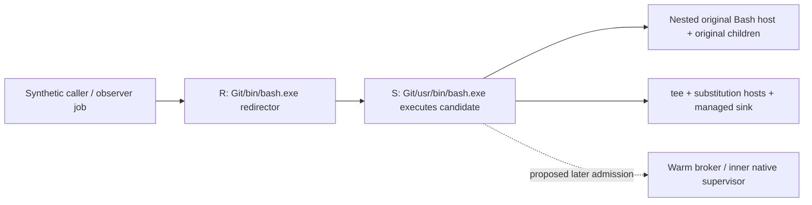

# C5 bridge architecture study — 2026-10-05

Status: read-only study completed; production bridge remains disabled. This
report proposes a bounded next investigation, not a source-ready supervisor
or broker. No CLI/context/account probe, build/test/script, source edit,
toolchain install, user settings change or new runtime evidence occurred.

## Recommendation

Resolve the upstream caller-root contract before implementing either proposed
bridge. On the known synthetic chain, an inner native supervisor and a warm
broker both have an admission gap: the Git redirector can create the executing
MSYS shell before either design owns that invocation. A broker which is already
running cannot protect an invocation it has not yet identified. This is a
source/architecture inference, not a newly reproduced failure or proof that
every possible upstream-integrated design is impossible.

Retain the unchanged gates: every candidate-launcher descendant terminates
within 2 seconds after tested top-level cancellation; launcher exit and
caller-side stdout/stderr EOF add at most 500 ms over paired baseline; preserve
exact original streams, exit and one execution. Baseline leakage does not waive
the candidate gate. W1 offline tray and inert/scratch capture sink remain usable
within their established scope.

## Grounded evidence and source boundaries

| Evidence | What it establishes | Limit |
|---|---|---|
| [Historical W2a result](windows-mvp-validation.md#w2a-tee-experiment--unsupported) | 34 pass / 9 fail / 43 cases; both candidates unsupported. Slow-runtime EOF overhead 3095 ms substitution / 3081 ms pipeline; hung sink exceeds observation timeout; pipeline finite-held-open case waits for producer | Historical recorded experiment, not rerun here |
| Same cancellation ledger | TerminateProcess baseline 4 / candidate 6 survivors; MSYS TERM baseline 3 / candidate 5 after 2 seconds; caller EOF false before harness cleanup | Whole candidate tree includes original shell/children; numbers are not helper-only |
| [ClaudeTests.cs](../../windows/tests/AIUsageBar.Tests/ClaudeTests.cs), lines 14, 423–581 | Top executable is Git/bin/bash.exe; paired streams/exit/one-execution checks; strict timing; explicit native redirector versus usr/bin/bash.exe signal target | Does not establish actual Claude 2.1.289 statusline execution context |
| [claude-tee-experiment.sh](../../windows/tests/AIUsageBar.Tests/claude-tee-experiment.sh), lines 10–25 | Bash original host, tee and capture substitution; sink output suppressed; original status saved | Shell redirects alone do not prove native handle lifetime or cancellation ownership |
| [WindowsProcess.cs](../../windows/src/AIUsageBar.Core/WindowsProcess.cs), lines 64–80 | Explicit standard-handle list; suspended child; assign no-breakaway kill-on-close job before resume | Creator controls only its owned child. ActiveProcessLimit=1 is Codex/fake transport policy, unsuitable for a Claude multi-child tree |
| [CodexTests.cs](../../windows/tests/AIUsageBar.Tests/CodexTests.cs), lines 322–428 | TestProcess owns an observer/cleanup job, assigns suspended root before resume, kills exact root handle, queries before cleanup | Observer job remains open during measurement. Its final cleanup is not production root-death protection |
| [Bridge Program.cs](../../windows/src/AIUsageBar.Bridge/Program.cs), lines 1–28 | Inert default; explicit scratch target; capture/read/filesystem deadline starts after managed entry; no publication before EOF | CLR/apphost startup precedes watchdog; no outer-tree ownership |

Current official Claude documentation says statusline commands use Git Bash
when present, otherwise PowerShell; a newer update cancels an in-flight script.
It does not specify Windows executable path, CreateProcess flags, exact kill
target/primitive, stdin-close timing or inherited-handle list. These current
docs are not pinned implementation evidence for installed 2.1.289.
[Claude Windows statusline](https://code.claude.com/docs/en/statusline#windows-configuration),
[statusline lifecycle](https://code.claude.com/docs/en/statusline#how-status-lines-work).

## Exact root and admission gap

R is the exact synthetic top-level PID returned by CreateProcessW. S is its
observed MSYS child, not interchangeable with R. All S/O/T descendants are in
the current strict candidate cleanup scope. The separate MSYS TERM experiment
signals the proved S whose Windows parent is that exact R.

The unresolved window is R creates S → S reaches candidate entry/connect.
Terminate R during this window and S has not yet received an invocation job or
keeper from the bridge. An inner native program starts even later. Calling the
candidate via a native-looking command string, `exec`, a startup readiness
probe, or a parent PID argument does not establish ownership before this
window. Whether actual Claude directly uses usr Bash, introduces a redirector,
or already owns an appropriate job remains unknown.

The Win32 model provides creator-side child job assignment and explicit handle
inheritance lists. A hypothetical upstream creator could use a job list at
creation, or suspended creation followed by assignment before resume. This
requires control of that creator and last-handle lifetime; an inner statusline
command cannot retroactively apply creator-side startup guarantees.
[UpdateProcThreadAttribute](https://learn.microsoft.com/en-us/windows/win32/api/processthreadsapi/nf-processthreadsapi-updateprocthreadattribute),
[AssignProcessToJobObject](https://learn.microsoft.com/en-us/windows/win32/api/jobapi2/nf-jobapi2-assignprocesstojobobject).

## Alternatives and decision limits

| Option | Advantage | Blocking cost/risk | Recommendation |
|---|---|---|---|
| Bridge disabled | Preserves supported offline scope and current restrictions | No live Claude capture | Choose now |
| Small first-party native supervisor | Can own original/sink children before their CLR startup; fewer per-invocation runtime prerequisites than managed helper | Does not own R→S admission by itself; no C compiler/VC toolchain found in prior survey; SDK prerequisites need verification; build/deployment change needs approval | Consider only after upstream ownership is concrete |
| Cooperative warm broker | Already-started .NET process could perform job/pipe operations without per-invocation CLR startup | Pre-connect admission gap; builtin MSYS named-pipe open/authentication/timeout and exact root binding unproven; Tray/broker death and normal completion need separate policy | Do not implement as a proposed fix now |

A standalone managed helper is not a fourth solution: its watchdog begins
after CLR entry, so it cannot enforce a deadline while its own runtime startup
is stalled. Native startup can also fail before entry; its benefit is owning
later children early, not an automatic proof of its own parent-death handling.
CreateProcess returns before initialization completes.
[CreateProcessW](https://learn.microsoft.com/en-us/windows/win32/api/processthreadsapi/nf-processthreadsapi-createprocessw).

For any later broker study, the minimum admission contract is: identify the
pipe peer through the OS, hold process handles, bind the supported outer root
without trusting a supplied PID/name, assign the supported inner shell before
helpers, and establish exact keeper ownership before READY. Client PID alone
does not prove ancestry or ownership. Pipe DACL/session restriction and
server identity must be defined, not assumed from an endpoint name.
[GetNamedPipeClientProcessId](https://learn.microsoft.com/en-us/windows/win32/api/winbase/nf-winbase-getnamedpipeclientprocessid),
[GetNamedPipeServerProcessId](https://learn.microsoft.com/en-us/windows/win32/api/winbase/nf-winbase-getnamedpipeserverprocessid),
[pipe access security](https://learn.microsoft.com/en-us/windows/win32/ipc/named-pipe-security-and-access-rights).

If a root-held keeper is proposed, duplicate it as noninheritable into the exact
held root process, account for every broker/root/child copy, and close all
broker copies before READY. A surviving broker copy defeats last-handle
closure. Premature closure kills the tree. Remote cleanup must address the
recorded handle in the held process, not reopen a PID which may be reused.
[DuplicateHandle](https://learn.microsoft.com/en-us/windows/win32/api/handleapi/nf-handleapi-duplicatehandle).

Jobs terminate associated processes on last handle close when kill-on-close is
enabled. Children launched with CreateProcess normally inherit membership,
but Win32_Process.Create is explicitly an exception; externally mediated
service/task launches cannot be promised as ordinary job descendants. No
breakaway flag is not a universal guarantee for arbitrary original scripts.
Any restriction to supported originals needs an explicit owner decision;
this study does not silently narrow the existing acceptance bar.
[Job Objects](https://learn.microsoft.com/en-us/windows/win32/procthread/job-objects).

## Stream, fallback and lifecycle requirements

| Case | Future proof required |
|---|---|
| Finite payload, producer keeps stdin open | Original can finish without waiting for capture EOF; paired exit/EOF overhead <=500 ms; no partial snapshot publication |
| EOF-driven original | Compare both runs from the same scheduled producer close, including large input and backpressure |
| Exact stdout/stderr and exit | Byte-for-byte streams including binary/Thai/quoting; concurrent drains; preserve arbitrary original status and one execution |
| Background original output | Preserve bytes and caller EOF timing when children retain streams. Killing the job on normal shell exit may truncate valid later output; waiting may delay root exit. Specify supported normal-completion semantics before claiming both guarantees |
| Slow/hung CLR or capture | Capture cannot retain caller stdout/stderr or force original to wait beyond 500 ms; all cancellation descendants <=2 s from root death, including before managed entry |
| Missing apphost/DLL/deps/runtimeconfig/runtime/native stage/broker | Capture availability cannot control original execution. No probe-then-rerun, replay of partially consumed input, raw-input file or command log |
| Failure before READY / connection loss / Tray quit | Exact process/handle owner and abort policy at every stage; no unowned suspended child, leaked keeper or unrelated termination |
| Missing/stalled broker | Bounded connection and fallback before consuming original input; Bash timed read alone does not prove bounded MSYS pipe open. Adding a native/.NET connector reintroduces an earlier unowned helper |

EOF requires every write handle to be closed, not merely original root exit.
Explicit inheritance control and actual caller-side measurement remain
necessary; helper redirection syntax is insufficient proof across MSYS/native
boundaries. Named-pipe blocking and overlapped modes are distinct, and their
availability in a native server does not prove a Bash builtin client contract.
[Pipe handle inheritance](https://learn.microsoft.com/en-us/windows/win32/ipc/pipe-handle-inheritance),
[CreateNamedPipeW](https://learn.microsoft.com/en-us/windows/win32/api/namedpipeapi/nf-namedpipeapi-createnamedpipew).

## Practical toolchain choices, without installation

The prior amendment survey recorded no MSVC/clang/VC tools. No new discovery or
install occurred here. Existing .NET/PInvoke is sufficient to model synthetic
creator/job/handle ownership after a separately approved test plan; this would
prove the model, not native supervisor startup or actual Claude behavior.

If a native branch later becomes justified, a minimal C/Win32 stage built with
Microsoft C++ Build Tools plus Windows SDK is the smallest clear candidate;
compiler/SDK components, source and deployment manifest require explicit setup
approval. NativeAOT is an alternative, but current Windows prerequisites also
include Visual Studio 2022+ with Desktop C++ components, plus a changed
RID/self-contained publish path. It is not available merely because dotnet is
installed, and it is not an ownership fix.
[Microsoft C++ command-line tools](https://learn.microsoft.com/en-us/cpp/build/building-on-the-command-line?view=msvc-170),
[NativeAOT prerequisites](https://learn.microsoft.com/en-us/dotnet/core/deploying/native-aot/).

## Bounded next study and stop rules

1. Save a decision-study plan and obtain owner selection: remain disabled, or
   authorize a disposable synthetic context study. No production source branch
   is selected by this report. Existing strict gates remain.
2. Define exact R/S/cancellation target, creation flags, startup/handle owners,
   normal-background policy and allowed original process-creation behavior.
   Current Claude docs cannot fill these cells. Authorized future observation
   must bind the exact version/path/identity; no account/model turn is implied.
3. If synthetic prototype work is later approved, first build a stage-controlled
   admission falsification: pause before S connects, kill R, observe all known
   descendants and caller EOF for 2 seconds before observer-job cleanup. Cover
   pre-connect, authenticated connection, pre-keeper, post-keeper/pre-READY,
   pre-resume and stalled-runtime stages. All stage gates belong to the synthetic
   harness; they must not become production environment switches.
4. Include a positive upstream-owned control and a negative inner-only control.
   State exactly which creator/keeper policy explains any passing result; a
   harness job left open during observation must never be credited as production
   cancellation. Run the full paired stream/fallback matrix only after the
   admission contract survives.
5. Stop if the bridge cannot own the supported root before every child starts,
   if the synthetic passing case depends on upstream controls Claude does not
   provide, or if preserving background/fallback behavior conflicts with the
   cleanup gate. Record unsupported; keep launcher/installer/settings off.

These are future proof requirements, not permission to author/run a harness.
Any concrete prototype needs its own reviewed source manifest and owner gates.
Actual account/context observations and toolchain setup are separate choices.

## Self-gate and scope

Re-read this report against Task 6, current Windows AGENTS, the historical
validation, shell/source paths and primary documentation. Relative source/docs
links target existing files; web references were opened on 2026-10-05. Mermaid
is a static ownership illustration, not measured runtime evidence. Only this
new report was written by its owner; other agents' edits were preserved. No
syntax/build/runtime test claim follows from a Markdown-only study.
